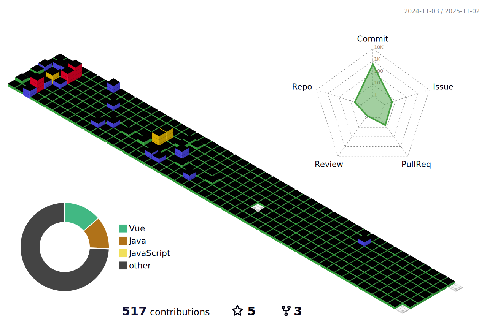

<h3 align="center">🌻 Tech Stack 🌻</h3>

<h4 align="center">💻 Programming Languages</h4>

<h4 align="center">🎨 Frontend & Frameworks</h4>

<h4 align="center">🗄️ Databases</h4>

<h4 align="center">🤖 AI/ML & Analytics</h4>

<h4 align="center">🎯 Design Tools</h4>

 

